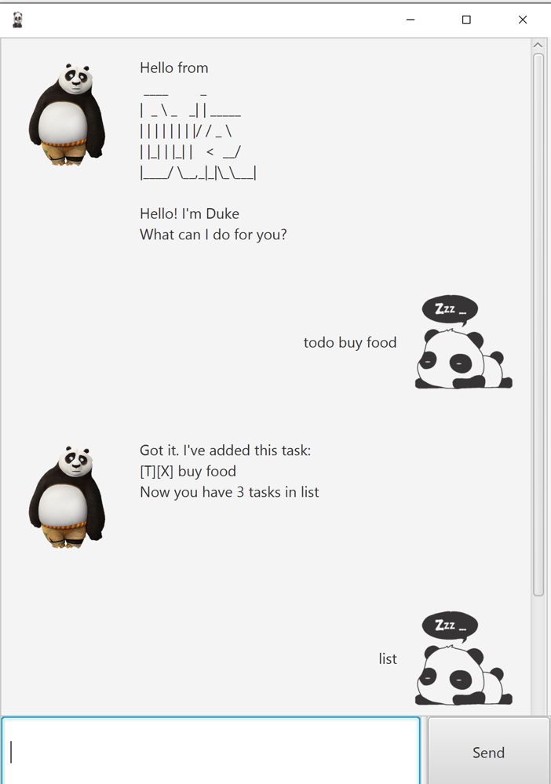

# User Guide
Duke is a task management tool which helps you to keep track of various task. It is a command line interface (CLI) which allows you to input your tasks by entering commands.

## Features 
1. Add task
2. Delete task
3. Find task
4. List task
5. Mark task as 'Done'
6. Undo Operation
7. Bye


## Feature description

### Add task 
you can create 3 different types of tasks - `event`, `todo` and `deadline`.

### Delete task
Delete a task from the task list.

### Find task
Find task(s) in the task list.

### List task
List out all task in the task list.

### Mark as 'Done'
Mark the task in the task list to be 'Done' to show that it has been completed.

### Undo 
Revert the operation.

### Bye 
Exit the application.

## Usage

### `todo` - To add a `todo` task in the task list <br/>
Create a todo task that will be added to the task list with the format `todo <task description>`

 
#### Example of usage:
```
todo gym
```
#### Expected outcome:
```
Got it. I've added this task:
[T][X]gym 
Now you have 1 tasks in the list.
```
### `event` - To add a `event` task in the task list <br/>
Create a event task that will be added to the task list with the format `event <task description> /at <Date format in YYYY-MM-DD> <time> `

 
#### Example of usage:
```
event edmond's birthday /at 2020-09-17 14:00 18:00
```
#### Expected outcome:
```
Got it. I've added this task:
[E][X]edmond's birthday (at: Sep 17 2020 2.00 PM to 6.00 PM)
Now you have 1 tasks in the list.
```

### `deadline` - To add a `deadline` task in the task list <br/>
Create a deadline task that will be added to the task list with the format `deadline <task description> /by <Date format in YYYY-MM-DD>`

 
#### Example of usage:
```
deadline math homework /by 2019-08-02 19:00
```

#### Expected outcome:
```
Got it. I've added this task: 
[D][X] math homework (by:Aug 2 2019 7 PM)
Now you have 1 tasks in the list.
```

### `delete` - To delete a task in the task list
Deletes a task in the task list with corresponding index number with the format in 'delete <task number>'

#### Example of usage:
```
delete 1
```

#### Expected outcome:
```
Noted. I've removed this task:
[T][X]gym 
Now you have 2 tasks in the list.
```

### `find` - To find task(s) in the task list
Find task(s) in the task list using a keyword with the format in 'find <task description>'

#### Example of usage:
```
find birthday
```

#### Expected outcome:
```
Here are the tasks in your list:
    1.[E][X] edmond's birthday (at: Sep 17 2020 2.00 PM to 6.00 PM)
```

### `list` - To list all task(s) in the task list
Display all the task(s) in the task list with the format in `list`


#### Example of usage:
```
list
```

#### Expected outcome:
```
Here are the tasks in your list:
1.[E][X] edmond's birthday (at: Sep 17 2020 2.00 PM to 6.00 PM)
2.[D][X] math homework (by:Aug 2 2019 7 PM)
```

### `done` - Mark a task as 'Done'
Marks a task in the task list as 'Done' with corresponding index number with the format in 'done <task number>'

#### Example of usage:
```
done 2
```

#### Expected outcome:
```
Nice!. I've marked this task as done:
[D][tick] math homework (by: Aug 2 2019 7 PM)
```

### `Undo` - Revert the operations
Revert back to the previous status. Able to `undo` all the way to the time when the application is just launched

#### Example of usage:
```
undo
```

#### Expected outcome:
```
Last operation delete 2 -> deletes the deadline task

Before Undo
    Here are the tasks in your list:
      1.[E][X] edmond's birthday (at: Sep 17 2020 2.00 PM to 6.00 PM)

After Undo 
    Here are the tasks in your list:
      1.[E][X] edmond's birthday (at: Sep 17 2020 2.00 PM to 6.00 PM)
      2.[D][tick] math homework (by:Aug 2 2019 7 PM)

``` 

### `bye` - Exit the application
"Terminates the application. The application will exit after 3 seconds."

#### Example of usage:
```
bye
```
#### Expected outcome:
```
Bye! Hope to see you again soon!
```